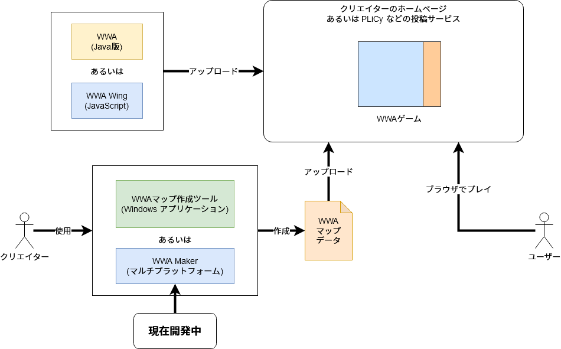

WWAのマップデータを制作できるアプリケーションです。

## WWAの構造と問題点

WWA では簡単に RPG ゲームを作成することができますが、それを実現するためには、上図のようにゲームデータが含まれている「マップデータ」とそのゲームデータを動かす環境「WWA Wing」の2つからなっています。

そのマップデータを制作するには、 WWA Wing が開発される前から原作者が開発した「[WWAマップ作成ツール](https://wwajp.com/making.html)」が存在していますが、下記の問題が発生していました。

- Windows でしか動作できない
- 編集できるフィールド画面が小さく、広大なフィールド画面の構築や編集に手間がかかる
- WWA Wing の新機能追加のボトルネックになっている
  - キャラクターの挙動を追加するといったマップデータのバリエーション追加を伴う変更については、WWAマップ作成ツールの改修が必要になってくる

WWA Maker はこの「WWAマップ作成ツール」を参考に、今の時代に対応できるように開発し直したアプリケーションとなります。

このアプリケーションの構想は2008年～2009年から始まり、当時WWAマップ作成ツールがMacでは動作できなかったことがきっかけになります。しかしながら、当時の技術力でデスクトップアプリケーションを開発できる能力はなく、WWAマップ作成ツール自体も構造が複雑でどうしても制作に着手することができませんでした。

2015年になると WWA Wing の登場と Web 技術の勉強に伴い、新しい Web 技術を活用して Webアプリケーション の開発ができないか検討することになりましたが、当時は同じ作成ツールの開発を進めていた人もいたため、開発を控えていました。しかしながら、このまま放置した結果、 WWA Maker 以外で開発したいアプリケーションが存在しない結果となり、学部時代でまともにアウトプットできていませんでした。

2019年になると、WWAに関わる開発が数少なく、早急な完成が求められることから、開発を再開しました。現在開発中で、2020年4月20日現在、基本的な編集機能や保存機能は実装を終えました。残っている作業はテストプレイ機能といった補助機能の追加やバグ修正といった調整作業になります。

## 開発体制

開発にあたっては、様々なライブラリを活用していますが、これらのプログラミング言語やライブラリは、学部時代で学習したノウハウやスキルを活用しています。

- TypeScript ... WWA Wing で提供されている型定義の活用
  - [WWA Wing PE](wwa_wing_pe) で得られたスキルを活用
  - 構造については、ソフトウェア工学の知識を活用
- monorepo ... 保存機能といったコードが長く分割可能な処理を独立する事によるメンテナンス向上
  - [WWA Wing の開発](wwa_wing) で得られたスキルを活用
- React ... WWA Maker のエディタのビュー制御や、コンポーネントのエコシステムの活用
  - [WWA Message Loader](wwa_collection) や [Aokashi Home](aokashi_home) で得られたスキルを活用
- Redux ... 編集している WWAデータ のステート管理
- Electron (今後使用予定) ... マルチプラットフォーム対応のアプリケーション化

また、 WWA Maker では WWA Wing と共通化できそうな処理は極力共通化するように心がけています。WWA Wing と共通化できそうな箇所が見つかった場合は、[WWA Wing の Issue](https://github.com/WWAWing/WWAWing/issues) に残すようにして、 WWA Wing を開発しているメンバーにも働きかけるように進めています。

- 一部のキャラクターを編集する際に「座標」の入力が必要 → 座標を示すための型情報とその型情報への変換が WWA Wing と共通化できる → [座標の型情報の定義と変換を行う API を提案](https://github.com/WWAWing/WWAWing/issues/220)
