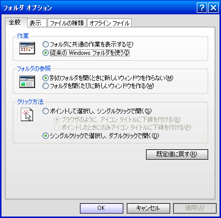

2010年1月に購入してもらったノートPC (HP Compaq 6710b) の動作が不安定になり、その後起動しなくなりました。

## 動作が不安定になった

当時使用していた Windows XP では、インターネットで配布されているテーマファイル (msstyles 形式) を使用することで、上図のようにウインドウやボタンなどの見た目を大きく変えることができました (ちなみに上図のテーマは自分が作りました)。

テーマファイルを使用するには、 Windows のシステムファイル (uxtheme.dll) を変更する必要がありました。そこで Windows のシステムファイルを差し替えるアプリケーションを実行したところ、後に動作が不安定になりました。発生した症状は下記の通りでした。

- スタートボタンの「スタート」の文字が消える
- コンテキストメニューの文字が消える
- ブラウザの文字が消える
- デスクトップのアイコンやタスクバーのアイコンが消える

この症状について、当時原因は分からなかったのですが、症状の関連性やインターネットの記事を見る限りだと、上記のシステムファイルの改変が原因だと感じました。

## 起動しなくなった
11月頃に Windows とは違ったOSである Ubuntu に触れてみたいと思い、手元のノートPCに Windows と Ubuntu のデュアルブートを試みました。ただ、そのPCのディスク容量はわずか80GBと、2つのOSを収めることが難しいため、USBメモリに Ubuntu をインストールしました。

しかしながら、 Ubuntu をインストールすると GRUB も一緒にインストールされるのですが、その GRUB は Ubuntu をインストールしたUSBメモリをPCに接続しないとエラーを起こしてしまい、 Windows 環境まで起動することができませんでした。

Ubuntu をインストールする前の状態に戻そうとインターネットで検索したところ、 Knoppix を使用してあるコマンドラインを入力すれば戻せると知りました。しかし実行したところ、起動しなくなってしまいました。

## その後
起動しなくなったノートPCは修理に出しましたが、OS が元々インストールされていた Windows に戻ることはありませんでした。それとは別に、キーボードが凹んでいるというハードウェア上の問題があることからキーボードの修理が行われました。

OS については別途リカバリーキットという Windows が再インストールできるディスクを使用することで、OS を Windows に戻すことができました。

### 対策
なるべく不安定な動作をなくすために、システムファイルの改変を避けるようにしました。しかしながら、 Windows XP のテーマファイルを使用して外観をカスタマイズしたい思いから Styler や TTClock といった外部ツールを使用することで「安定した動作」と「カスタマイズ」の両立を図りました (その後 Windows 側の改良もあって、あまり外部ツールに頼ることはなくなりました)。

Ubuntu といった Linux については VirtualBox などの仮想PCや使用していないPCにインストールするようにし、1つのPCに複数のOSを共存するデュアルブートを避けるようにしました。

キーボードについては OS のトラブルとは直接的な関係は無かったのですが、ハードウェアを大事に扱わないといけないことから、外付けキーボードを購入しました。 **これが、作業環境の強化を進めるきっかけになりました**。
