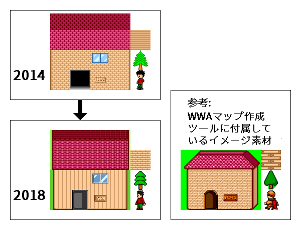

WWA のイメージ素材を制作しています。 WWA そのものを制作するつもりでしたが、Macでは作成ツールが起動できず、代わりに素材を制作することがきっかけになります。

最初は付属していたArcSoftのPhotoStudioを使用していました。これは写真編集用のツールですので、GIF画像に上手に出力できず、WWAではそのまま使用できないフルカラーPNG画像で保存、投稿していました。

2010年にWindowsパソコンを入手すると、ドット絵制作ソフトのEDGEが利用できることから、GIF画像として制作しました。WWA素材としてそのまま扱うことが可能になったのですが、この頃になるとWWAゲームの制作者が減ってしまい、利用されることはありませんでした。しかし、制作を通じて、以下のことが学べました。

- GIF には「パレット」という概念があり、好きな色を 256色 設定することができる
- そのうちの1色を、透明部分に利用する「透過色」として設定することができる
- WWAの素材では、多くはWWAの制作者が使用している82色のパレットを使用していることが多かった

なお、WWA素材で制作していたものは多くは建築物や装飾物と言った現代の人工物が中心で、制作当初はWWAの素材の中ではこれらが少なかったことから、現在に至るまで50近くも制作していました。現代が好きになったのは遊んでいたゲームに影響を受けたことと、現物が近くにあることからだと思います。

2015年以降になると、WWAの作成ツールに付属しているイメージ素材と混ぜても良いように雰囲気を変更して制作しました。具体的には以下のように工夫を加えています。

- 黒枠線の追加
- 人物イメージの腕と脚の動きの変更
- 色のコントラストを高めに設定

2016年以降ではWWA Wingの開発が進んだことで、WWA作品の制作に利用されるようになりました。

<link-button href="/material/wwa/">WWA素材を見てみる</link-button>

このWWA素材は制作を始めた2008年から現在まで続けています。元々はゲーム制作の代替として始まったのですが、他者の WWA 画像素材に影響を受けたこともあって画像素材の制作は長続きし、完成度は高まっていきました。 **自分が一番深く取り組んだものとしては、おそらくこのWWA素材の制作が正しいかもしれません**。

## 他のゲーム作成ツールの素材の制作 (2017 - 2018)

この他にも、 RPG ツクールMV 対応の素材も制作しました。この時期になると、「視点の角度」や「光の当たり方」などといった立体的な考えを考慮しながら制作してきました。

<link-button href="/material/tkool_mv/">RPGツクールMV 対応素材を見てみる</link-button>

詳細については下記関連リンクから自分のブログの記事をご確認ください。
