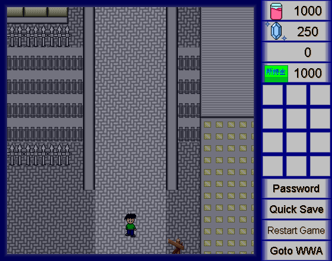

[WWA Wing の開発](wwa_wing) がある程度進んだことで、 WWA Wing をベースに新しい機能を追加した WWA Wing PE を開発しました。

## 開発の経緯

きっかけは、ヒラリラーが WWA Wing に拡張機能を追加した [WWA Wing XE](https://github.com/hirarira/WWAWingXE) を開発したことでした。

### 拡張クラスについて

実は、 WWA は WWA Wing として JavaScript に移植される前 (つまり Java 言語で作られていた頃) のところでは **拡張クラス** が使用できるようになっていました。拡張クラスを使用することで、本来 WWA のゲーム作成では使用できないプログラミングの変数や条件分岐を使用することが可能で、この拡張クラスをきっかけに表現豊かなゲーム作品や、自由度の高いゲーム作品が作られるようになりました。

当時の拡張クラスは、拡張クラスに対応した WWA のプログラムと、ユーザー書いた Java 言語のプログラムの2つを使用すること実現できました。また、ユーザーが Java 言語を書かなくても作成ツールだけでプログラムがかける WWA の代替プログラム **WWAeval** が公開されました。プログラミングの変数や条件分岐が活用できることはもちろん、グラフィック描画機能が含まれていました。

自分もこの WWAeval を使用してゲーム作品を制作したことがあり、下記のように画面を暗くして夜を演出する用途で使用していました。



ただし、 WWA と同様に Java 言語で記述されている Java アプレットのため、移植が必要になりました。

前者のプログラミングの変数や条件分岐は WWA Wing XE が担うことになりました。後者のグラフィック描画機能を担当する WWA Wing があっても良いのではないかと思い、開発を始めました。

## 内容

WWA Wing PE は WWA Wing をベースに、ピクチャを表示するための特定の文字列をメッセージに加えることで、ピクチャを表示させたり、動かしたりできるように開発しました。

表示できる内容は単純にイメージを表示するだけでなく、テキストを表示させたり、アニメーションでイメージを動かしたり、画面全体をフェードインやフェードアウトをさせたりすることができます。これらの機能を活用することで、下記のような演出が期待できます。

- 攻撃のエフェクト演出 (無くても実現できたが、1マス毎にパーツの配置と削除を行う必要があって大変手間がかかっていた)
- 街に入った場合に街の名前を一定時間表示する
- 劇イベント (例えば、画面が暗くなったり・・・)

これは、元となった WWAeval の機能を参考にしています。

開発にあたっては専用のモジュールを用意することで、 WWA Wing 本体に追加するソースコードの行数を抑えています。

その他にも、与えられた変数によって渡す処理内容が異なる場面では、下記のように連想配列を活用しました。

```typescript
/**
 * 文字列 property はピクチャの表示方法です。
 *     propertyTable ではその property から値を受け取り、その値をピクチャを管理しているクラスのプロパティに設定しています。
 */
const propertyTable: { [key: string]: (property: StringMacro) => void } = {
    pos: (property) => { // 表示位置
        this._pos.x = property.getIntValue(0, 0);
        this._pos.y = property.getIntValue(1, 0);
    },
    time: (property) => { // 表示時間
        let time = property.getIntValue(0, 0);
        this._displayTime.setTime(time);
    },
    time_anim: (property) => { // 表示時間 (アニメーションがある場合)
        let startTime = property.getIntValue(0, 0);
        let endTime = property.getIntValue(1, 0);
        this._delayAnimationTime.setTime(startTime);
        this._animationTime.setTime(endTime);
    },
    // 省略
    font: (property) => { // 文字
        let fontSize = property.getIntValue(0, FONT_DEFAULT_SIZE);
        if (fontSize <= 0) {
            throw new Error("フォントサイズの指定が不正です");
        }
        this._displayTextSize = fontSize;
        this._displayTextBoldMode = property.getBooleanValue(1, false);
        this._displayTextItalicMode = property.getBooleanValue(2, false);
        this._displayTextFont = property.getStringValue(3, "");
    },
    color: (property) => { // 文字色
        let r = property.getIntValue(0, 0);
        let g = property.getIntValue(1, 0);
        let b = property.getIntValue(2, 0);

        this._displayTextColor = new wwa_data.Color(r, g, b);
    }
};

// 実際の処理では、メッセージから各 property を読み取り、それぞれ上記の propertyTable に対応した処理を実行させています。
propertyTable[property.macroName](property);
```

## 問題点

しかしながら、開発を進めると、画像を表示したり動かしたりするため、座標といった WWA Wing の基礎部分の改修が必要になりました。

WWA Wing PE では開発が完了すると、その WWA Wing PE で追加された機能を WWA Wing にも取り入れる予定がありました。しかし一方で WWA Wing では、リファクタリングの作業を進めていました。

そこで基礎部分の改修を行うと、 WWA Wing のリファクタリングと干渉することになりました。

このままではちゃんとした形で完成することが難しく、開発は中止になりました。

ただ、 TypeScript や JavaScript では **関数を変数のように振る舞うことが可能** ということが今回の開発で知ることができました。これにより、入門書や仕様書にはあまり載っていないテクニックを見つけて応用することができました。

今後はなるべく前述のリファクタリングと干渉しない形で WWA Wing にピクチャを表示する追加機能を開発したり、WWA Wing の開発で説明されている「全く新しいゲームシステムの開発」のところで WWA Wing PE と同様の機能を加えたりしようと考えています。
